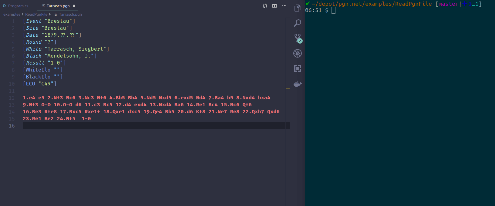

PGN.NET Core
============
_A .NET Core library for working with [Portable Game Notation (PGN)](http://en.wikipedia.org/wiki/Portable_Game_Notation)._



What's PGN.NET Core?
--------------------
PGN.NET Core is a library that parses portable game notation (PGN), a format for storing chess games. The PGN parser mostly conforms to [this specs](http://www.saremba.de/chessgml/standards/pgn/pgn-complete.htm), but tries to be as tolerant as possible.

The parser is based on [FParsec](http://www.quanttec.com/fparsec/), and the entire project is a fork of [Igor Lankin](https://github.com/iigorr)'s [pgn.net](https://github.com/iigorr/pgn.net) (seriously, buy the man a beer!).

Getting started
---------------

### Installing
_This project isn't currently published to [NuGet](https://www.nuget.org/), so in the meantime use the original [pgn.net package](https://www.nuget.org/packages/pgn.NET/), or clone this repository and build from source._

### PGN.NET Core
With PGN.NET Core installed in your project, you can try to read and parse a PGN file.

```csharp
using ilf.pgn;
using ilf.pgn.Data;

// ...

// Read a PGN file.
var reader = new PgnReader();
var gameDb = reader.ReadFromFile("Tarrasch.pgn");

// Get the first game from the file and print it to the console.
Game game = gameDb.Games[0];
Console.WriteLine(game);
```

Have a look at [the ReadPgnFile project](/examples/ReadPgnFile), and the other examples if you get stuck. If you need an example of a PGN file, have a look in [/pgn.NET.Test/TestExamples](/pgn.NET.Test/TestExamples).

Acknowledgments
---------------
This project wouldn't be possible without [Igor Lankin](https://github.com/iigorr) and [pgn.net](https://github.com/iigorr/pgn.net), from which this fork borrows heavily.

Building
--------
### Installing dependencies
You'll need a recent version of [.NET Core](https://dotnet.microsoft.com/download) and [git](https://git-scm.com/downloads). You'll probably want [a decent editor](https://code.visualstudio.com/) for C# and F# as well, but you probably have that installed already.

### Building and testing
With everything in place, navigate to `pgn.NET.Test`, and build the project:
```shell
$> cd pgn.NET.Test/
$> dotnet build
Microsoft (R) Build Engine version 15.9.20+g88f5fadfbe for .NET Core
Copyright (C) Microsoft Corporation. All rights reserved.

  Restore completed in 42.35 ms for /pgn.net/pgn.Parse/pgn.Parse.fsproj.
  Restore completed in 42.32 ms for /pgn.net/pgn.NET.Test/pgn.NET.Test.csproj.
  Restore completed in 42.35 ms for /pgn.net/pgn.NET/pgn.NET.csproj.
  Restore completed in 42.35 ms for /pgn.net/pgn.Data/pgn.Data.csproj.
  pgn.Data -> /pgn.net/pgn.Data/bin/Debug/netstandard2.0/pgn.Data.dll
  pgn.Parse -> /pgn.net/pgn.Parse/bin/Debug/netstandard2.0/pgn.Parse.dll
  pgn.NET -> /pgn.net/pgn.NET/bin/Debug/netstandard2.0/pgn.NET.dll
  pgn.NET.Test -> /pgn.net/pgn.NET.Test/bin/Debug/netcoreapp2.1/pgn.NET.Test.dll

Build succeeded.
    0 Warning(s)
    0 Error(s)

Time Elapsed 00:00:02.11
```

If everything went as expected, you can try to run the tests:
```shell
$> dotnet test
Build started, please wait...
Build completed.

Test run for /pgn.net/pgn.NET.Test/bin/Debug/netcoreapp2.1/pgn.NET.Test.dll(.NETCoreApp,Version=v2.1)
Microsoft (R) Test Execution Command Line Tool Version 15.9.0
Copyright (c) Microsoft Corporation.  All rights reserved.

Starting test execution, please wait...

Total tests: 18. Passed: 18. Failed: 0. Skipped: 0.
Test Run Successful.
Test execution time: 2.3071 Seconds
```
